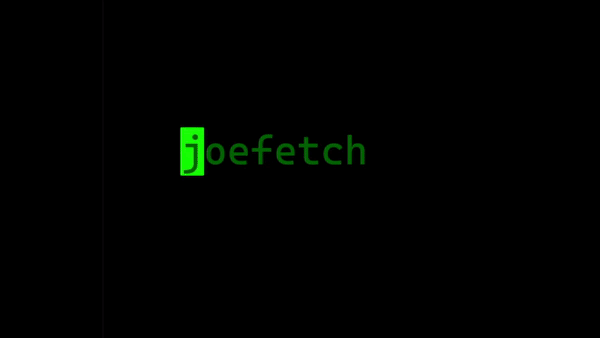

> this looks like SHIT! - joetroll</small>

# WARNING!!
install script doesn't work on fish, so please modify it for fish.

## requirements
- [any of the nerdfonts](https://www.nerdfonts.com)
- gcc (or zig)

## how to compile

- Using zig
`zig cc joefetch.c -o joefetch`

- Using gcc
`gcc joefetch.c -o joefetch`

to apply config, you must recompile the fetch every time

## why?
it's main purpose is to be **fast** and **simple** to configure. it's an alternative to fastfetch but with actual simple configuration. it's also *one* C file, so you can change the source whenever you want.

## i got a question!!!
either open an issue or look at the wiki to see if your answer is there.

# screenshot

